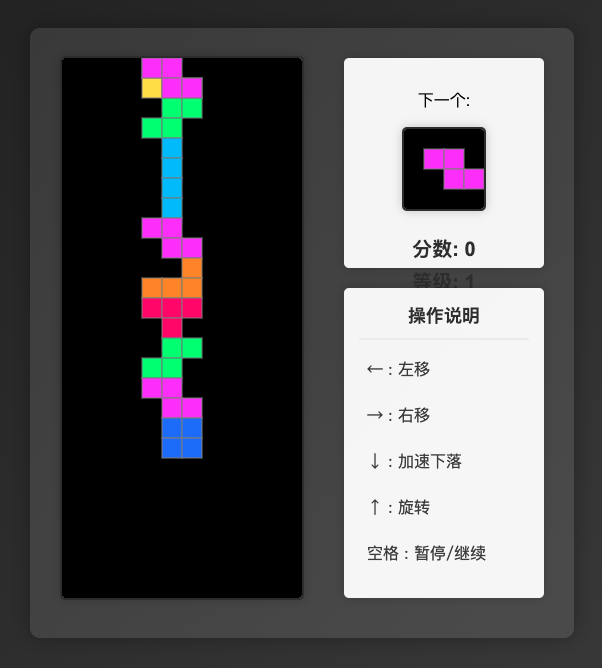

# 俄罗斯方块游戏

## 游戏截图

### 游戏主界面

### 游戏进行中

### 游戏结束画面

## 目录结构
- index.html: 游戏主页面
- styles.css: 样式文件
- tetris.js: 游戏逻辑
- README.txt: 说明文档
- images/: 游戏截图文件夹
  - game-start.png: 游戏主界面截图
  - game-play.png: 游戏进行中截图
  - game-over.png: 游戏结束截图

## 游戏介绍
用Cursor，10分钟写了一个经典的俄罗斯方块游戏，使用 HTML5 Canvas 和 JavaScript 开发。玩家通过操控不同形状的方块，将其堆叠并消除完整的行来获取分数。

## 操作说明

### 键盘控制
- **左方向键 (←)**: 将方块向左移动
- **右方向键 (→)**: 将方块向右移动
- **下方向键 (↓)**: 加速方块下落
- **上方向键 (↑)**: 旋转方块

### 按钮控制
- **暂停按钮**: 点击可暂停/继续游戏

## 游戏规则

### 基本规则
1. 方块会自动从顶部落下
2. 玩家可以移动和旋转方块
3. 当方块无法继续下落时，会固定在当前位置
4. 当一行被完全填满时，该行会被消除
5. 当方块堆到顶部时，游戏结束

### 计分规则
- 消除1行：100分 × 当前等级
- 消除2行：300分 × 当前等级
- 消除3行：500分 × 当前等级
- 消除4行：800分 × 当前等级

### 等级系统
- 初始等级为1级
- 每获得1000分提升一级
- 每提升一级，方块下落速度会加快
- 最快下落速度有上限（100毫秒/格）

## 游戏界面说明
- 左侧：主游戏区域
- 右上：下一个方块预览
- 右下：分数和等级显示
- 暂停按钮：控制游戏暂停/继续

## 方块类型
游戏包含7种不同形状的方块，每种都有独特的颜色：
1. T型方块（粉红色）
2. I型方块（浅蓝色）
3. S型方块（绿色）
4. Z型方块（紫色）
5. L型方块（橙色）
6. J型方块（黄色）
7. O型方块（蓝色）

## 游戏结束
当新的方块无法正常出现在游戏区域顶部时，游戏结束。游戏结束后会显示最终得分，玩家可以选择重新开始游戏。

## 游戏技巧
- 注意观察"下一个方块"预览，提前规划放置位置
- 合理利用加速下落可以更快获得分数
- 保持方块堆叠的平整度有助于获得更多消行机会
- 随着等级提升，游戏难度会逐渐增加，需要更快的反应速度

## 开发技术
- HTML5 Canvas
- JavaScript
- CSS3

## 浏览器支持
- Chrome (推荐)
- Firefox
- Safari
- Edge

## 如何运行
1. 下载所有文件到同一目录
2. 使用浏览器打开 index.html 文件
3. 开始游戏！

## 版权信息
本游戏为开源项目，可自由使用和修改。 